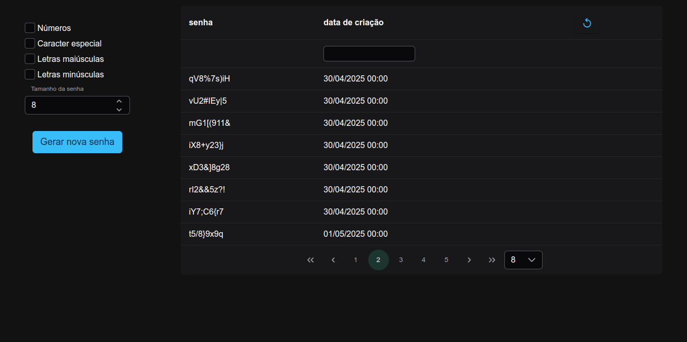

## 🔐 Gerador de Senhas

Projeto feito com  [Angular CLI](https://github.com/angular/angular-cli) version 19.2.3.


🚀 Funcionalidades
- Geração de Senhas: Formulário para solicitar a geração de novas senhas.

- Listagem Paginada: Exibição do histórico de senhas geradas com paginação.

- Filtro por Data: Capacidade de filtrar o histórico de senhas por data específica.

- Integração com Backend: Comunicação com a API  para geração e listagem de senhas.

🛠️ Tecnologias Utilizadas

- Angular 19
- NgPrime (biblioteca de estilização)


📦 Instalação 

clone o repositorio:

```bash
ssh:
git clone git@github.com:jonatas401/password-generate-front.git

https:
git clone https://github.com/jonatas401/password-generate-front.git
```

Após clonar o projeto rode o comando:

```bash
nmp install
```


Para inciar o projeto rode o comando:

```bash
ng serve
```

✨ Acesse a aplicação:

http://localhost:4200




